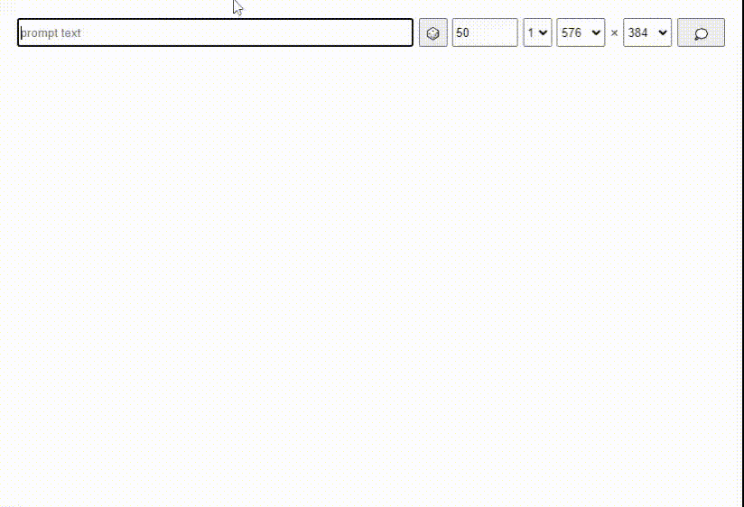

# Diffusers Web

This project is a web based image generation tool, a front-end wrapper for [HuggingFace's diffusers](https://github.com/huggingface/diffusers).

## Usage

Run the web server:

```.bash
python ./main.py
```

If this works, navigate to *http://localhost:8157* in your browser.

## Features

### Text to image



### Image transform

Navigate to *http://localhost:8157/converter*.


### Mask and outpainting

Before run web server, config the diffuser model to a inpainting model. e.g. add a environment variable in `.env.local`:

```
DIFFUSER_MODEL_PATH=runwayml/stable-diffusion-inpainting
```

Then navigate to *http://localhost:8157/painter*.


## Requirements

### Hardware

A GPU with CUDA capability is required for good performence. The more video memory the better, 24GB is recommended.

### Python

Install requirement libraries with pip, reference to [requirements.txt](./requirements.txt).

## Local Enviroment Variables
Edit local enviroment variables in file *.env.local*.

Variable Name						| Default Value						| Description
:--									| :--								| :--
**HF_TOKEN**						|									| Your HuggingFace access token. If a local config path provided, this can be ignored.
**DIFFUSER_MODEL_PATH**				| CompVis/stable-diffusion-v1-4		| This can be a local model config path.
**TEXTGEN_MODEL_PATH**				| k-l-lambda/clip-text-generator	| The random painting description generator model path. This can be a local model config path.
**HTTP_HOST**						| 127.0.0.1							|
**HTTP_PORT**						| 8157								|
**SSL_CONTEXT**						| None								| Use `'adhoc'` for https server.
**DEVICE**							|									| `cuda` or *None*
**TEXT_DEVICE_INDEX**				| 0									| This can be greater than 0 if **CUDA_VISIBLE_DEVICES** has more than 1 gpu specified.
